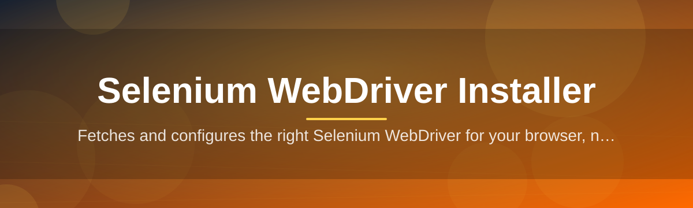

# Selenium-WebDriver-Installer-3247 🧭⚙️

  

*One click, one binary, one perfectly matched WebDriver — no version-hunting required.*

  

---

## 📦 Overview

Selenium-WebDriver-Installer-3247 is a standalone Windows utility that solves the single most repetitive chore in browser automation: finding, downloading, and wiring up the *correct* WebDriver binary for whatever browser and version happens to be sitting on your machine. Anyone who has automated a browser knows the drill — Chrome auto-updates overnight, your `chromedriver` suddenly throws a session-not-created error, and you burn twenty minutes hunting through changelogs to find the matching build. This tool removes that entire cycle.

Under the hood, it's built for QA engineers, test automation leads, and developers running Selenium WebDriver suites who would rather spend their time writing assertions than babysitting driver binaries. The installer detects installed browser versions locally, resolves the compatible driver release, downloads it over a verified channel, and drops it exactly where your `PATH` or test framework expects it — no manual PATH editing, no registry surgery.

It exists because the Selenium ecosystem, for all its power, never shipped a first-class driver manager for people who just want automation to *work*. Language-specific driver managers exist, but they're tied to a single SDK. Selenium-WebDriver-Installer-3247 is SDK-agnostic — it serves your Selenium WebDriver setup regardless of whether your tests are written in Python, Java, C#, or JavaScript.

> [!NOTE]
> This tool manages driver binaries only. It does not modify, patch, or repackage any browser or Selenium library — it strictly automates the official download-and-place workflow.

---

## 🚀 What It Actually Does

- **Browser fingerprinting** — scans your local Chrome, Firefox, and Edge installations and reads their exact version strings before touching the network.

- **Version-matched retrieval** — cross-references detected browser versions against the official driver release manifests, so you never end up with a mismatched WebDriver build again.

- **Zero-touch PATH wiring** — places the resolved driver binary in a predictable folder and optionally updates your user `PATH`, so `selenium.webdriver.Chrome()` just finds it.

- **Multi-browser support** — handles ChromeDriver, GeckoDriver, and Microsoft Edge WebDriver from a single interface, so multi-browser test matrices stay in sync.

- **Rollback-friendly caching** — keeps the last few known-good driver versions cached locally, letting you pin a specific version if a browser update breaks your suite.

- **Integrity verification** — checksums every downloaded binary against published hashes before it's ever unpacked, so corrupted or partial downloads are rejected automatically.

- **Silent CI mode** — a headless execution flag lets build agents and CI runners fetch the right driver without any UI interaction.

- **Update watch** — an optional background check flags when your installed browser has drifted ahead of your cached driver version.

> [!TIP]
> Pin a specific driver version before a big release cycle using the *Lock Version* toggle in Settings — this keeps your regression suite stable even if the browser auto-updates mid-sprint.

---

## 🧗 Getting Started

1. Visit the landing page linked in the download button below and grab the latest signed build.

2. Run the installer executable — no elevated permissions or dependency stack required.

3. Let it auto-detect your installed browsers, or manually point it at a browser executable if you run a portable install.

4. Click **Install Driver** — the matched WebDriver binary lands in your chosen output folder, ready for Selenium to pick up.

> [!IMPORTANT]
> Restart your terminal or IDE after installation if you opted into the automatic PATH update — environment variable changes don't propagate to already-open shells.

---

<strong>💻 System Requirements</strong>

 

| Requirement | Detail |
|---|---|
| OS | Windows 10 (64-bit) or Windows 11 |
| Dependencies | None — fully standalone, self-contained executable |
| Disk space | ~45 MB for the app, plus a few MB per cached driver |
| Network | Outbound HTTPS access to fetch driver manifests and binaries |
| Permissions | Standard user account — admin rights only needed for system-wide PATH edits |

  

> [!NOTE]
> There is no macOS or Linux build. This project is deliberately Windows-first, tuned to the quirks of Windows PATH handling and browser install locations.

---

## 🔬 How It Works

The installer follows a short, deterministic pipeline every time it runs — no guesswork, no silent fallback logic hidden from the user.

1. **Scan** — reads installed browser binaries and extracts version metadata from disk.

2. **Resolve** — matches that version against the official driver release index.

3. **Fetch** — downloads the corresponding WebDriver archive over HTTPS.

4. **Verify & Place** — checksums the archive, extracts it, and writes it to your configured driver directory.

> [!TIP]
> Run the CLI flag `--dry-run` (exposed in Advanced Settings) to preview which driver version *would* be installed without actually downloading anything.

---

<strong>🩹 Troubleshooting Common Issues</strong>

 

**Q: The installer says "browser not detected" but Chrome is clearly installed.**
A: This usually happens with portable or non-default install paths. Use the manual "Locate Browser" picker in Settings and point it directly at `chrome.exe`.

**Q: Selenium still throws `SessionNotCreatedException` after installing.**
A: Your browser likely auto-updated after the driver was installed. Re-run the installer — the version-matched retrieval step will catch the drift.

**Q: Download fails with a checksum mismatch.**
A: This means the archive was corrupted mid-transfer, usually due to an unstable connection or a corporate proxy intercepting HTTPS. Retry, or switch networks temporarily.

**Q: The tool can't write to my chosen output folder.**
A: Check folder permissions, or rerun with elevated rights if you're targeting a system-protected directory like `Program Files`.

**Q: Can I use this with GeckoDriver for Firefox?**
A: Yes — Firefox and GeckoDriver are fully supported alongside Chrome and Edge in the same interface.

**Q: My CI pipeline hangs waiting for input.**
A: Make sure you're launching with the silent/headless flag — the interactive UI is skipped entirely in that mode.

---

<strong>🎨 Interface, Shortcuts & Personalization</strong>

 

The interface is intentionally minimal — a single-window layout with a status pane, a browser list, and an action bar. No nested menus to get lost in.

| Shortcut | Action |
|---|---|
| `Ctrl + R` | Re-scan installed browsers |
| `Ctrl + Enter` | Install matched driver |
| `Ctrl + L` | Toggle version lock |
| `Ctrl + ,` | Open Settings |
| `Esc` | Cancel active download |

- **Themes** — Light, Dark, and a System-synced auto mode that follows your Windows theme setting.

- **Output path memory** — the last chosen driver directory is remembered per browser, so repeat installs take one click.

- **Compact mode** — collapses the browser list into a dropdown for smaller windows or lower-resolution displays.

> [!WARNING]
> Disabling checksum verification in Advanced Settings is not recommended — it exists only for restricted network environments where hash servers are unreachable, and it removes a real safety guarantee.

---

## 🤝 Contributing & Community

Bug reports, feature requests, and pull requests are welcome through the repository's Issues and Discussions tabs. Before opening a PR, please check existing issues to avoid duplicate effort — the maintainers triage weekly.

- Found a mismatched driver mapping? Open an issue with your browser version and OS build.

- Want to suggest support for an additional browser engine? Start a Discussion thread first so the approach can be scoped.

- Documentation fixes and typo corrections are always appreciated and fast-tracked.

> Community conventions: be specific, include logs where relevant, and search before you file. It keeps the backlog useful for everyone.

---

## 📜 License

Released under the [MIT License](LICENSE), 2026. Use it, fork it, ship it inside your own tooling — attribution appreciated but not required beyond what MIT already asks for.

---

## ⚠️ Disclaimer

Selenium-WebDriver-Installer-3247 is an independent utility and is not affiliated with, endorsed by, or officially connected to the Selenium project, Google Chrome, Mozilla Firefox, or Microsoft Edge. All trademarks belong to their respective owners. The tool automates publicly available driver downloads; users remain responsible for complying with each browser vendor's terms of use.

---

